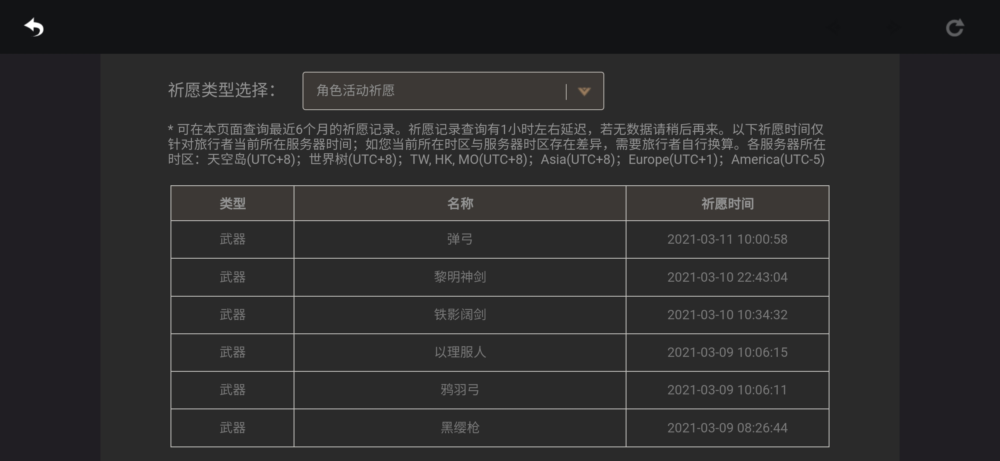
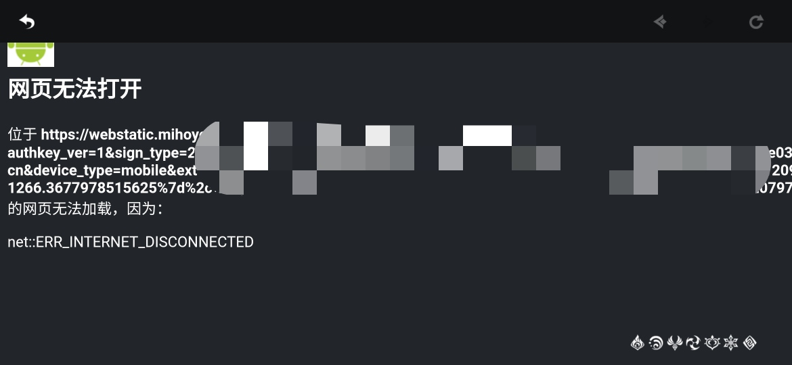
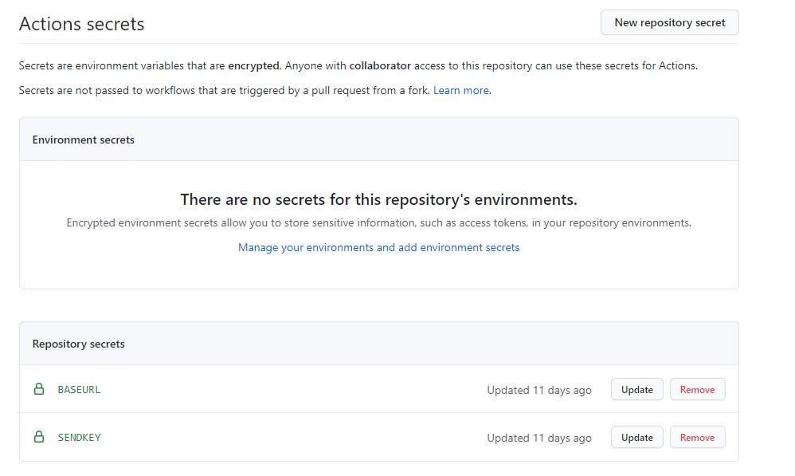
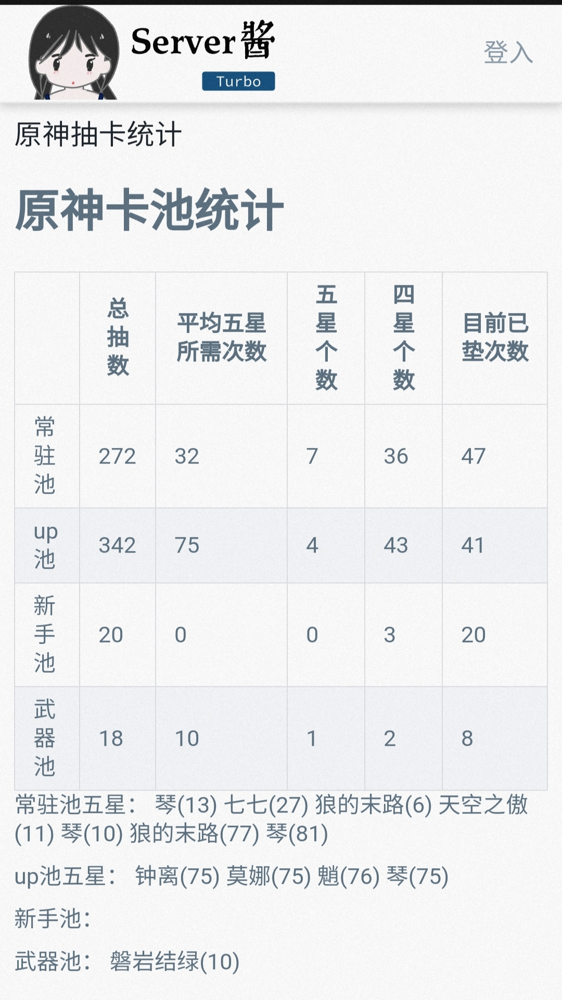

# 原神卡池记录分析(手机端)

网上已经有不少对原神电脑端的卡池记录分析和导出，但是没有手机端的，像我这样的手机端玩家就很烦，还要重新下一个电脑端。

由于不想重复造轮子，[电脑端导出可以看这个](https://bbs.nga.cn/read.php?&tid=25004616&rand=488)

## 基本步骤

### 获取链接

打开手机端原神的任意历史记录页面，断网并刷新，会出现如下图的链接

先复制下来

### fork

fork本项目，点击setting->secrets

创建如图的BASEURL的key，并填入上一步骤的链接

### 运行

点击github里的action->Java CI with Maven->Run workflow

### 查看结果

在build中查看日志

### 推送结果到微信

#### Server酱

**a.获取 SCKEY**

- 使用 GitHub 登录 [sc.ftqq.com](http://sc.ftqq.com/?c=github&a=login) 创建账号
- 点击「[发送消息](http://sc.ftqq.com/?c=code)」，获取`SCKEY`
- 点击「[微信推送](http://sc.ftqq.com/?c=wechat&a=bind)」，完成微信绑定

**b.添加 SENDKEY到 Secrets**

- 建立名为`SENDKEY`的 secret(步骤同`BASEURL`)，并添加获取的 `SCKEY`值，即可开启Server酱推送

